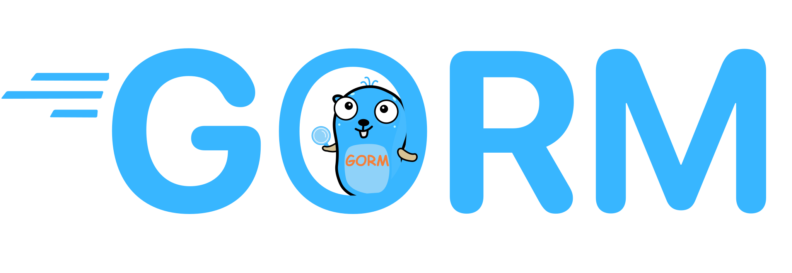

 # Users & Products manager

This project is a RESTful API for a simple CRUD (Create, Read, Update, Delete) system, built with Go.

## Technologies Used
 
     
 
- [Go](https://golang.org/): Programming language used to develop the application.
- [Chi](https://github.com/go-chi/chi): Lightweight and fast HTTP router for Go.
- [GORM](https://gorm.io/): ORM (Object-Relational Mapping) in Go for database handling.
- [SQLite](https://www.sqlite.org/index.html): Embedded SQL database system.
- [Swaggo](https://github.com/swaggo/swag): API documentation tool for Go.

## Installation

To install and run this project locally, follow these steps:

1. Clone the repository to your local machine.
2. Navigate to the project directory.
3. Run `go mod tidy` to download the project dependencies.
4. Run `go run cmd/server/main.go` to start the server.

## Usage

The API supports the following operations:

- `POST /users`: Creates a new user.
- `POST /users/generate_token`: Generates a JWT token for a user.
- `GET /users`: Returns all users.
- `POST /products`: Creates a new product.
- `GET /products`: Returns all products.
- `GET /products/{id}`: Returns a specific product.
- `PUT /products/{id}`: Updates a specific product.
- `DELETE /products/{id}`: Deletes a specific product.

## Documentation

The API documentation is available at `http://localhost:8000/docs/doc.json` when the server is running.

## Contribution

Contributions are welcome! Please feel free to open an issue or submit a pull request.
